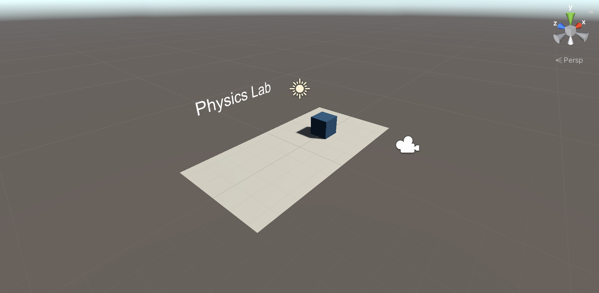

# Physics Lab
A Unity project modelling an harmonic oscillator. For use in “Physics Engines” module at ZHAW. This Unity project requires the Unity Editor LTS release [2021.3.17f1](https://unity.com/releases/editor/qa/lts-releases?version=2021.3 "Unity's LTS releases web page").

## How to run 
1. Download (or clone) this repository.
2. In the Unity Hub, add the repository as a project and open it.
3. In the Unity Editor, open the *HarmonicOscillator* scene in the *Scenes* directory.
4. Click on the blue cube and adjust its mass and the spring constant in the inspector window.
4. Press the *Play* button.